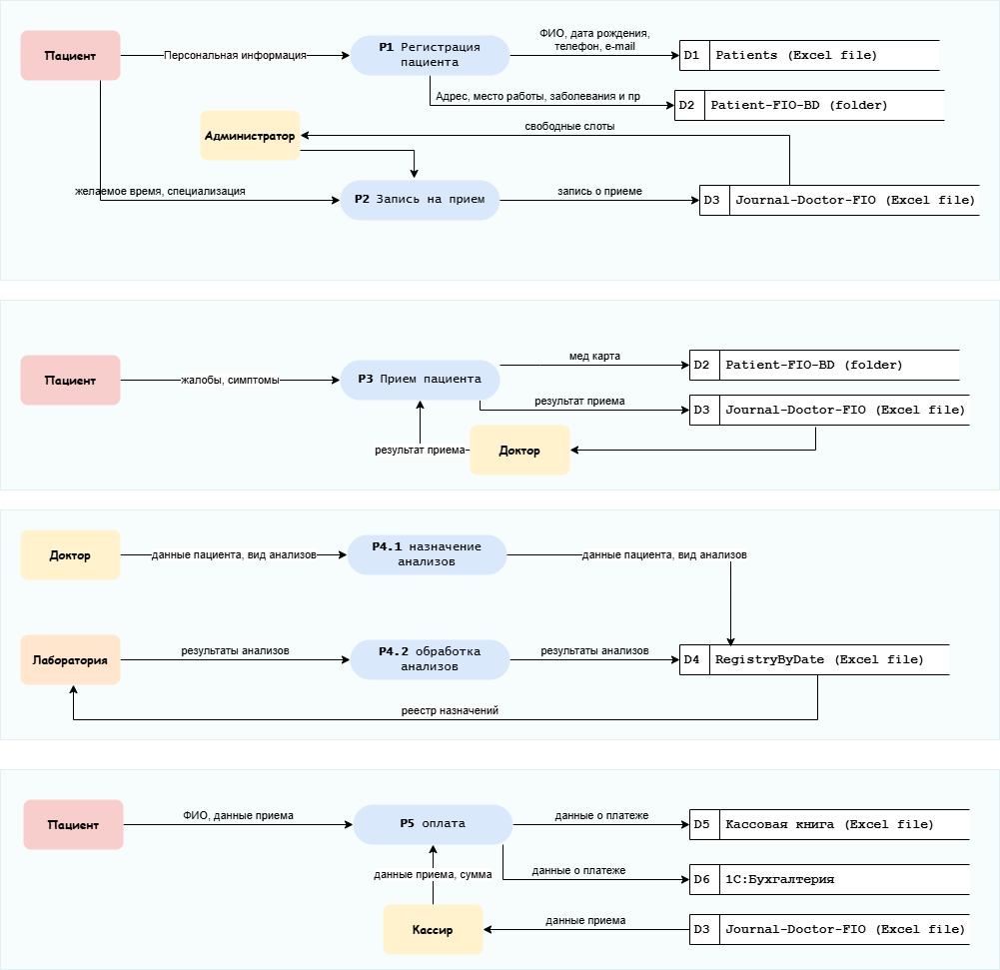

# Задание 1. Анализ безопасности системы

## Потоки данных
[Диаграмма drawio](./diagrams/DFD.drawio)

## Список проблемных зон

| Проблема | Описание | Критичность | Способы решения |
| --- | --- | --- | --- |
| Отсутствие контроля доступа к данным | Данные на общем диске с общим доступом, только доменная аутентификация. Нет RBAC, риск несанкционированного доступа к ПДн (ФИО, здоровье). | Высокая | Внедрить RBAC, МИС с контролем доступа, аудиты. |
| Отсутствие аудита действий с данными | Нет логов действий с файлами и системами 1С, невозможно отслеживать утечки. | Высокая | Внедрить логирование (в 1С, Windows Audit), SIEM, внутренний аудит. |
| Ручная обработка и хранение данных в незащищенных форматах | Ручные операции в Excel/PDF без шифрования, подвержены ошибкам и потерям. | Высокая | Автоматизировать, перейти от набора файлов к МИС,  шифрование (BitLocker, TDE) |
| Отсутствие контроля внутренних потоков данных | Нет контроля потоков между 1С-системами, без шифрования в транзите. | Средняя | Шифрование (TLS), API Gateway, DLP, уведомление в реестре (ст. 22). |
| Локальное хранение без мер резервирования и восстановления | Нет бэкапов/восстановления, риск потери данных от сбоев/атак. | Средняя | Резервное копирование (Veeam), облако с бэкапами, план DR (ст. 19). |
| Риск человеческого фактора в обработке данных | Ручной ввод, нет MFA/обучения, риски ошибок/утечек. | Средняя | Электронные формы, обучение (152-ФЗ), MFA, автоматизация (ст. 18.1). |

## Список данных для защиты и способы их защиты

| Категория данных | Тип данных | Чувствительность | Способ хранения (As-Is) | Рекомендуемые методы защиты (To-Be) |
| --- | --- | --- | --- | --- |
| **1\. Идентификационные ПДн** | ФИО, дата рождения, телефон, email, адрес, паспортные данные, полис ОМС/ДМС | Высокая | Excel, сканы документов на общем диске | **Шифрование (в покое)** AES-256 на уровне БД/файловой системы. |
| **Маскирование** для сотрудников, которым не нужны полные данные (например, , `+7 *** *** 1234`). |   |   |   |   |
| **Обезличивание** при передаче во внешние системы (напр. в Лабораторию). |   |   |   |   |
| **2\. Медицинские данные (специальные категории ПДн)** | Диагнозы, история болезни, назначения, результаты анализов, заключения врачей, снимки (рентген, МРТ) | Критическая | Excel, PDF/JPG на общем диске | **Шифрование (в покое и при передаче)** TLS 1.3 для передачи. |
| **Изоляция в отдельном домене/хранилище** с усиленным контролем доступа (например, отдельная схема в БД, отдельный файловый сервер с квантовым шифрованием). |   |   |   |   |
| **Детальный аудит** всех операций CRUD (Создание, Чтение, Обновление, Удаление). |   |   |   |   |
| **3\. Финансово-платежные данные** | Сумма оплаты, реквизиты платежей, данные договоров, банковские реквизиты пациентов (если есть) | Высокая | 1С, Excel | **Шифрование** финансовых транзакций. |
| **Сегментация сети**: изоляция платежного шлюза и 1С-сервера в отдельном сегменте. |   |   |   |   |
| **Маскирование** в интерфейсах для большинства сотрудников (видно только `***1234`). |   |   |   |   |

## Механизм тегирования данных

### **Классы информации**

| **Уровень** | **Название тега** | **Значения** |
| --- | --- | --- |
| **Тип данных** | `**DataType**` | `**PII**`**,** `**PHI**`**,** `**Financial**`**,** `**Operational**`**,** `**Anonymized**` |
| **Чувствительность** | `**Sensitivity**` | `**Low**`**,** `**Medium**`**,** `**High**`**,** `**Critical**` |
| **Требуемые меры** | `**Protection**` | `**Encrypt**`**,** `**Anonymize**`**,** `**Obfuscate**`**,** `**AuditAll**`**,** `**RBAC-Strict**`**,** `**NoExport**` |

### **2.2. Инструменты и методы тегирования**

*   **На уровне базы данных:** Использование столбцов-меток в таблицах (например, `data_classification`).
*   **На уровне файловой системы:** **File Classification Infrastructure** + **Dynamic Access Control**